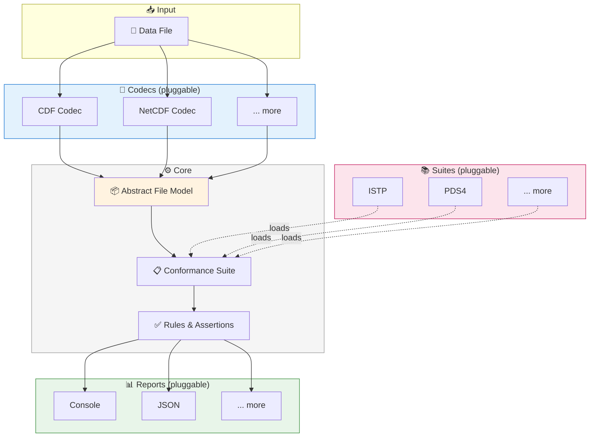

<h1 align="center">

</h1><br>

# AstraLint

AstraLint is a Python linter for Space Physics data files, validating conformance to standards such
as [ISTP](https://spdf.gsfc.nasa.gov/istp_guide/) and [PDS4](https://pds.nasa.gov/datastandards/documents/).

## Overview

AstraLint validates data files against conformance suites using a **codec-agnostic architecture**:

1. **Codecs** transform file formats (e.g., CDF) into a common abstract representation ([
   `File`](src/astralint/base/file.py))
2. **Suites** define collections of validation rules (e.g., ISTP, PDS4)
3. **Rules** check specific requirements, defined either in Python or YAML

## Usage

```bash
# Lint a file against the default ISTP suite
astralint lint myfile.cdf

# Lint against a specific suite
astralint lint myfile.cdf --suite PDS4

# Select specific rules
astralint lint myfile.cdf --select "MandatoryGlobalAttributes"

# Ignore specific rules
astralint lint myfile.cdf --ignore "MandatoryGlobalAttributes"

# List available suites
astralint list-suites
```

## Architecture



## File Model

The abstract `File` model is the core data structure that all codecs produce. Rules and assertions operate on this unified representation:

```
File
├── compression: str                     # e.g., "gzip", "none"
├── attributes: {name → Attribute}       # Global metadata
│   ├── "Project"      → Attribute
│   ├── "PI_name"      → Attribute
│   └── ...
└── variables: {name → Variable}         # Data variables
    ├── "Epoch" → Variable
    │   ├── name: str                    # "Epoch"
    │   ├── shape: [int]                 # e.g., [1440]
    │   ├── attributes: {name → Attribute}
    │   │   ├── "CATDESC"  → Attribute
    │   │   ├── "FILLVAL"  → Attribute
    │   │   └── ...
    │   └── config: VariableBits
    │       ├── compression: str         # "gzip", "none"
    │       ├── data_type: DataType      # TT2000, FLOAT64, ...
    │       └── record_variance: bool
    ├── "Temperature" → Variable
    └── ...

Attribute
├── name: str
└── data_type: DataType

DataType = CHAR | UINT8 | UINT16 | UINT32 | UINT64
         | INT8 | INT16 | INT32 | INT64
         | FLOAT32 | FLOAT64
         | TT2000 | CDFEPOCH | CDFEPOCH16
```

### Path Navigation

Rules use `/`-separated paths with regex support to navigate the model:

| Path Example | Description |
|--------------|-------------|
| `attributes` | Global attributes dictionary |
| `attributes/Project` | Specific global attribute |
| `variables` | All variables dictionary |
| `variables/Epoch` | Specific variable |
| `variables/.*/attributes` | Attributes of all variables |
| `variables/Epoch/config/data_type` | Data type of a specific variable |

## Defining Rules in YAML

Rules can be defined declaratively in YAML files. Example from [
`MandatoryAttributes.yaml`](src/astralint/suites/ISTP/rules/MandatoryAttributes.yaml):

```yaml
name: MandatoryGlobalAttributes
description: "All mandatory global attributes must be present"
url: "https://..."
reference: "ISTP-MD-003"
severity: ERROR
suite: ISTP

assertions:
  - path: "attributes"
    check: contains_keys
    keys:
      - Data_type
      - Logical_source
      - PI_name
    message: "Missing mandatory global attribute: {key}"

  - path: "variables/.*/attributes"
    check: contains_keys
    keys: [ CATDESC, FIELDNAM, FILLVAL ]
    message: "Variable missing required attribute: {key}"
```

### Available Assertion Types

| Check           | Description                                |
|-----------------|--------------------------------------------|
| `contains_keys` | Verifies an object contains required keys  |
| `matches`       | Validates a string matches a regex pattern |
| `is_type`       | Checks a value has the expected data type  |

## Supported File Formats

| Format | Extension | Library                                       |
|--------|-----------|-----------------------------------------------|
| CDF    | `.cdf`    | [pycdfpp](https://github.com/SciQLop/pycdfpp) |

## Available Conformance Suites (WIP/Demo)

- **ISTP** - [ISTP Metadata Guidelines](https://spdf.gsfc.nasa.gov/istp_guide/)
- **PDS4** - [Planetary Data System v4](https://pds.nasa.gov/datastandards/documents/)

## Extending AstraLint

### Adding a New Codec

Create a new codec in `src/astralint/codecs/`:

```python
from astralint.base import Codec, File, classproperty


class MyCodec(Codec):
    @classproperty
    def supported_extensions(cls) -> list[str]:
        return ["ext"]

    @staticmethod
    def load(path: str) -> File:
        # Transform your file format into the abstract File model
        ...
```

### Adding a New Assertion Type

Create a new assertion in `src/astralint/base/yaml_rules/assertions/`:

```python
from typing import Literal, Any
from .base import BaseAssertion, resolve_path, ValidationResult, File


class MyAssertion(BaseAssertion):
    check: Literal["my_check"] = "my_check"

    # Add custom fields as needed, they will be populated from the YAML rule definition
    # e.g., expected_value: Any

    def single_assertion(self, file: File, path: str, value: Any) -> ValidationResult:
        # Implement your validation logic here, this method will be called for each path/value pair that matches the base assertion's path pattern
        # path is the resolved path in the File model, value is the value at that path
        ...
```

* * *

## Project Docs

For how to install uv and Python, see [installation.md](docs/installation.md).

For development workflows, see [development.md](docs/development.md).

For instructions on publishing to PyPI, see [publishing.md](docs/publishing.md).

* * *

*This project was built from
[simple-modern-uv](https://github.com/jlevy/simple-modern-uv).*
